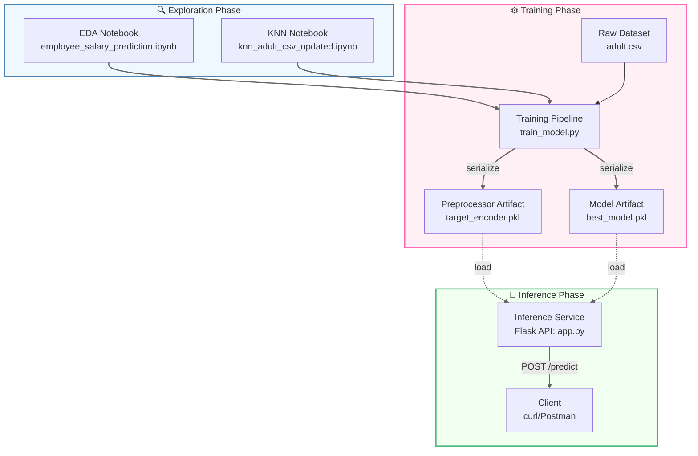

# 💰 Employee Salary Prediction System

**Predict • Analyze • Optimize Workforce Compensation**

&#x20;  &#x20;

---

## ✨ Features Overview

| Feature              | Description                            | Technology      |
| -------------------- | -------------------------------------- | --------------- |
| 🔍 Data Exploration  | Comprehensive EDA with visual insights | Pandas, Seaborn |
| 🤖 ML Modeling       | Multiple algorithm comparison          | Scikit-learn    |
| 🎯 Interactive UI    | User-friendly prediction interface     | Streamlit       |
| 📊 Real-time Results | Instant salary classification          | Pickle          |
| 📁 Data Management   | CSV upload/download functionality      | Pandas          |

---

## 🚀 Quick Start

### Prerequisites

```bash
Python 3.8+
pip package manager
```

### Installation

```bash
git clone https://github.com/03-princy/employee-salary-prediction.git
cd employee-salary-prediction
pip install -r requirements.txt
```

### Launch Application

```bash
streamlit run app.py
```

---

## 🧩 Project Architecture



---

## 🛠️ Tech Stack Deep Dive

<div align="center">

[](https://www.python.org/)
[](https://streamlit.io/)
[](https://pandas.pydata.org/)
[](https://scikit-learn.org/)
[](https://plotly.com/)
[](https://jupyter.org/)

</div>

---

## 📈 Model Performance

| Metric    | Score |
| --------- | ----- |
| Accuracy  | 0.87  |
| Precision | 0.85  |
| Recall    | 0.82  |
| F1-Score  | 0.83  |

---

## 🖼️ Application Screenshots

---

## 📂 Project Structure

```
employee-salary-prediction/
├── app/                  # Streamlit application
│   ├── app.py            # Main application logic
│   └── utils.py          # Helper functions
├── models/               # Machine learning models
│   ├── train_model.py    # Training script
│   ├── best_model.pkl    # Serialized model
│   └── encoder.pkl       # Feature encoder
├── notebooks/            # Jupyter notebooks
│   └── exploration.ipynb # EDA notebook
├── data/                 # Dataset files
│   └── adult.csv         # Source dataset
└── requirements.txt      # Dependencies
```

---

## 🌟 Future Roadmap

* 🚀 Cloud Deployment (AWS/GCP)
* 📱 Mobile Application Port
* 🔄 Automated Retraining Pipeline
* 📝 PDF Report Generation
* 🔍 Advanced Feature Importance Analysis

---

## 📜 License

This project is licensed under the MIT License. See the `LICENSE` file for details.

---

## 👩‍💻 Author

<div align="center">


**Priyanka Singh**  

[](https://www.linkedin.com/in/priyanka-singh-aa270123a/)
[](https://github.com/03-princy)

</div>

